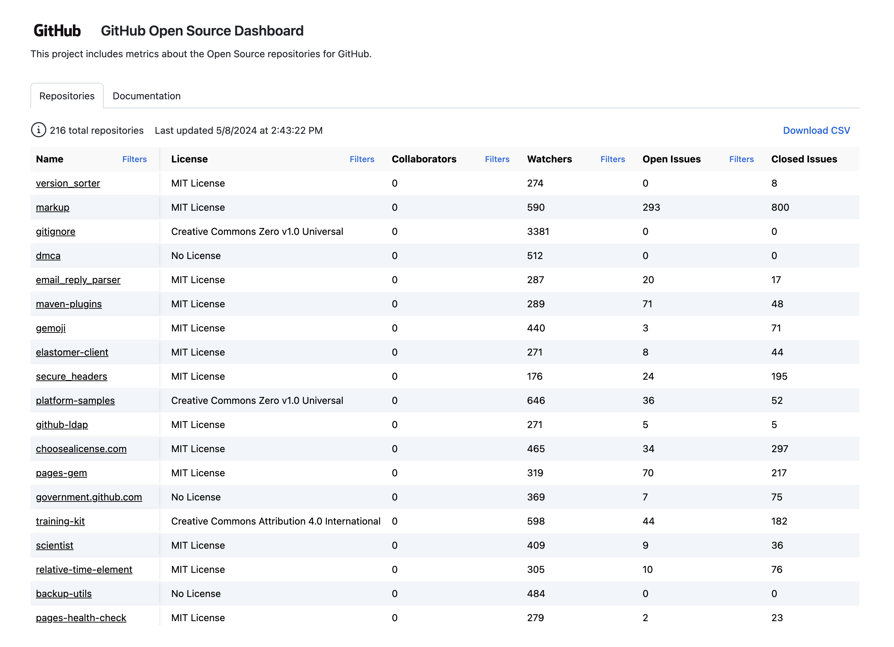

# Org Metrics Dashboard

An actions-powered dashboard to get an overview of your organization's open source repository health.

[](https://github-community-projects.github.io/org-metrics-dashboard)

The dashboard provides a quick overview of your organization's public repositories. It fetches data from the GitHub API using actions and displays it in a github pages site. The dashboard provides the following information about your repositories:

- License information
- Issue and PR counts
- Metrics around response times for issues and PRs

Check out the live demo [here](https://github-community-projects.github.io/org-metrics-dashboard).

## Setting up the project for your organization

### Fork the repository

You will need to [fork this repository](https://github.com/github-community-projects/org-metrics-dashboard/fork) into your org. Alternatively, you can clone this repository and push it to your org.

### Actions

Since we use the GitHub API and actions to generate the data, you will need to enable actions for the repository. You can do this by going to the `Actions` tab in the repository and enabling actions.

You will need to set a secret in the repository settings. The secret is a GitHub token that has admin read access to the organization. You can create a token by going to `Settings` -> `Developer settings` -> `Personal access tokens` and creating a new token with the following scopes.

- read:org
- read:repo
- read:project

> [!NOTE]
> To fetch collaborator counts, you need to provide a token that is an admin of the organization.

The secret should be named `GRAPHQL_TOKEN`. You can set this for your repository in `Settings` -> `Secrets and variables` -> `Actions`.

### Configuration

There is a `config.yml` located in the root of the project that contains the configuration for the project. The configuration is as follows:

```yaml
---
# The GitHub organization name
organization: 'github-community-projects'
# An ISO 8601 date string representing the date to start fetching data from
since: '2024-02-22'
# Path of the github pages site. i.e. github-community-projects.github.io/org-metrics-dashboard
# This will typically be "/{REPOSITORY_NAME}" if you are hosting on GitHub pages
basePath: '/org-metrics-dashboard'
```

- `organization`: The name of the organization you want to fetch data from.
- `since`: The date to start fetching data from. This is useful if you want to fetch data from a specific date.
- `basePath`: **Important**. This is the path where the site will be hosted. If you are hosting the site on GitHub pages, you will need to set this to the repository name for links and assets to work correctly.

## Development

This project is split into two parts:

- **app**: the code for the frontend
- **backend**: the code for the backend and fetcher

Both are written in TypeScript. We use [npm workspaces](https://docs.npmjs.com/cli/v8/using-npm/workspaces) to manage the dependencies between the two projects.

### Prerequisites

- Node.js 20.X or later
- npm

### Environment variables

You will need a `.env` file in the root of the project:

```sh
cp .env.example .env
```

The `GRAPHQL_TOKEN` token requires the following scopes:

- read:org
- read:repo
- read:project

> [!NOTE]
> To fetch collaborator counts, you need to provide a token that is an admin of the organization.

### Installation

```sh
npm i
```

### Running the monorepo

This will kick off both the fetcher and the app.

```sh
npm run dev
```

### Running each part separately

If you wish to run the backend only:

```sh
npm run dev:backend
```

If you wish to run the app only:

> Note that you need to provide a valid `data.json` file in the `app/src/data` directory in order to render the app.

```sh
npm run dev:app
```

## License

This project is licensed under the terms of the MIT open source license. Please refer to [MIT](./LICENSE.md) for the full terms.

## Maintainers

Check out the [CODEOWNERS](./CODEOWNERS) file to see who to contact for code changes.

## Support

If you need support using this project or have questions about it, please [open an issue in this repository](https://github.com/github-community-projects/org-metrics-dashboard/issues/new) and we'd be happy to help. Requests made directly to GitHub staff or the support team will be redirected here to open an issue. GitHub SLA's and support/services contracts do not apply to this repository.

## More OSPO Tools

Looking for more resources for your open source program office (OSPO)? Check out the [`github-ospo`](https://github.com/github/github-ospo) repo for a variety of tools designed to support your needs.
